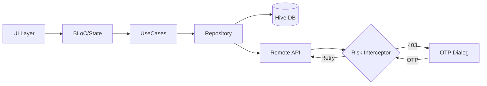

# Better Pro Assignment

A resilient, Clean Architecture-based Flutter application demonstrating advanced transaction handling, risk management, and offline capabilities.

## 🌟 Key Features

*   **Resilient Transaction System**:
    *   **Write-Ahead Logging (WAL)**: Ensures local persistence before network calls, preventing data loss during crashes or network failures.
    *   **Offline-First**: Transactions are stored locally (Hive) and synchronized when possible.
    *   **Robust Error Handling**: Handles timeouts (504), risk challenges (403), and server errors gracefully.
    *   **Retry Mechanism**: Intelligent backoff strategies for transient network issues.

*   **Advanced Risk Management**:
    *   **Risk Interceptor**: Automatically detects `403 Risk Challenge` responses.
    *   **Interactive Resolution**: Triggers a seamless OTP dialog flow without disrupting the user experience.
    *   **Transparent Retry**: Automatically retries the original request with the OTP token upon successful verification.
    *   **Infinite Loop Prevention**: Smart logic to prevent recursive retry loops on repeated failures.

*   **Clean Architecture & Best Practices**:
    *   **Layered Design**: Strict separation of concerns (Presentation, Domain, Data).
    *   **Dependency Injection**: Powered by `get_it` and `injectable` for testability and modularity.
    *   **BLoC Pattern**: Predictable state management using `flutter_bloc`.
    *   **Type Safety**: Extensive use of `freezed` for immutable data classes and unions.
    *   **Rich Domain Model**: Domain-driven design with Value Objects (e.g., `Amount`, `Currency`).

## 🏗 Architecture Overview



## 🛠 Tech Stack

*   **Framework**: Flutter
*   **Language**: Dart
*   **State Management**: flutter_bloc
*   **Networking**: Dio (with custom Interceptors)
*   **Local Database**: Hive (NoSQL, fast & lightweight)
*   **DI**: get_it, injectable
*   **Code Generation**: build_runner, freezed, json_serializable
*   **Testing**: mocktail, bloc_test

## 📂 Project Structure

```
lib/
├── core/                   # Core utilities, DI, Network, Constants
│   ├── constants/          # API endpoints, Error codes, Configs
│   ├── di/                 # Dependency Injection modules
│   ├── network/            # Dio setup & Interceptors (Risk, Retry, Mock)
│   └── usecases/           # Base UseCase definitions
├── features/
│   └── transaction/        # Transaction Feature
│       ├── data/           # Repositories, DataSources (Local/Remote), Models
│       ├── domain/         # Entities, UseCases, Repository Interfaces
│       └── presentation/   # BLoC, Pages, Widgets
└── main.dart               # App Entry point
```

## 🚀 Getting Started

### Prerequisites

*   Flutter SDK (Latest Stable)
*   Dart SDK

### Installation

1.  **Clone the repository**:
    ```bash
    git clone https://github.com/yourusername/better_pro_assignment.git
    cd better_pro_assignment
    ```

2.  **Install Dependencies**:
    ```bash
    flutter pub get
    ```

3.  **Generate Code**:
    ```bash
    flutter pub run build_runner build --delete-conflicting-outputs
    ```

4.  **Run the App**:
    ```bash
    flutter run
    ```

## 🧪 Testing

### Running Unit Tests

The project includes Unit Tests for the BLoC layer using `bloc_test` and `mocktail`.

```bash
flutter test
```

### Testing the Risk Flow (Mock)

The app includes a `MockServerInterceptor` to simulate various API scenarios without a real backend.

1.  **Submit a Transaction**: Enter an amount and select currency.
2.  **Mock Behavior**:
    *   **Success (60%)**: Transaction completes immediately.
    *   **Risk Challenge (20%)**: 
        *   Server returns `403`.
        *   App shows **"Security Verification"** dialog.
        *   Enter OTP: `123456`.
        *   App retries and completes the transaction.
    *   **Timeout/Error (20%)**: Server returns `504` or other errors.

## 📝 Assignment Highlights

This project addresses the "Better Pro Assignment" requirements by implementing:

1.  **Phase 1 (Domain)**: Defined `Transaction`, `Amount`, `Currency` entities and UseCases.
2.  **Phase 2 (Data & Network)**: Implemented Repository pattern with `Hive` for local storage and `Dio` for network.
3.  **Phase 3 (UI & State)**: Created `TransactionPage` and `TransactionBloc` for UI interaction.
4.  **Phase 4 (Risk Resolver)**: Built a complete Risk Challenge flow using `QueuedInterceptor` and `RiskChallengeResolver`.

## 🤝 Contributing

Contributions are welcome! Please feel free to submit a Pull Request.
